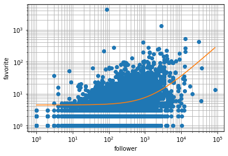
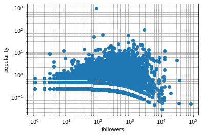

# Description
Do regression analysis for number of followers and favorites of some tweets related to specific topics for acquiring popular tweets and make the list of them on website from the result.
Currently, the topic is Splatoon!

### buzzclip
The name of Django project. It contains settings.py.

### Mainapp
Django application that handles data and passes it to React through API.
It also contain the analysis script named "analyzer.py" that works like referred to in description.

### frontend
React application. in App.js, React takes data of tweets from API and embed them.

## analysis method
Code shown as below is performed under analyzer.py 
~~~
import pandas as pd
import matplotlib.pyplot as plt

df = pd.read_csv('tweet_data.csv') # a data list from twitter API contains number of followers and favorites.
df = df[df["followers"] != 0].sort_values("followers")

x = df["followers"]
y = df["fav"]

plt.plot(x, y, "o")

def reg1dim(x, y):
    n = len(x)
    a = ((np.dot(x, y)- y.sum() * x.sum()/n)/
        ((x ** 2).sum() - x.sum()**2 / n))
    b = (y.sum() - a * x.sum())/n
    return a, b

a, b = reg1dim(x, y)

print(a)
print(b)

plt.plot(x, a * x + b)

plt.xscale('log')
plt.yscale('log')
plt.xlabel('follower')
plt.ylabel('favorite')
plt.grid(which='both')
~~~

~~~
buz_factors = [] 
# Popularity Index. introduced by calculating the ratio of the number of favorites of each tweet to avarage number of it.

for i in range(len(df)):
    factor = y.values[i] / (a * x.values[i] + b)
    buz_factors.append(factor)

df["buz_factors"] = buz_factors

x = df["followers"]
y = df["buz_factors"]

plt.plot(x, y, "o")

plt.xscale('log')
plt.yscale('log')
plt.xlabel('followers')
plt.ylabel('popularity')
plt.grid(which='both')
~~~
  
If popularity is 10^2, that tweet has 100 times as many favorites as avarage. 
~~~
df.to_csv('mediaanalyzed.csv')
~~~
